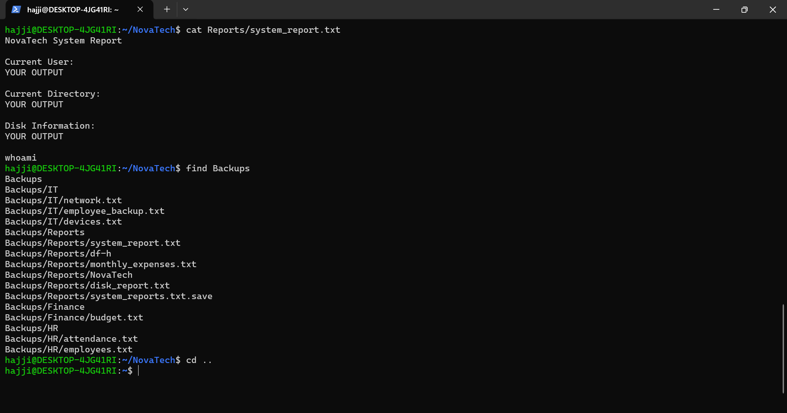
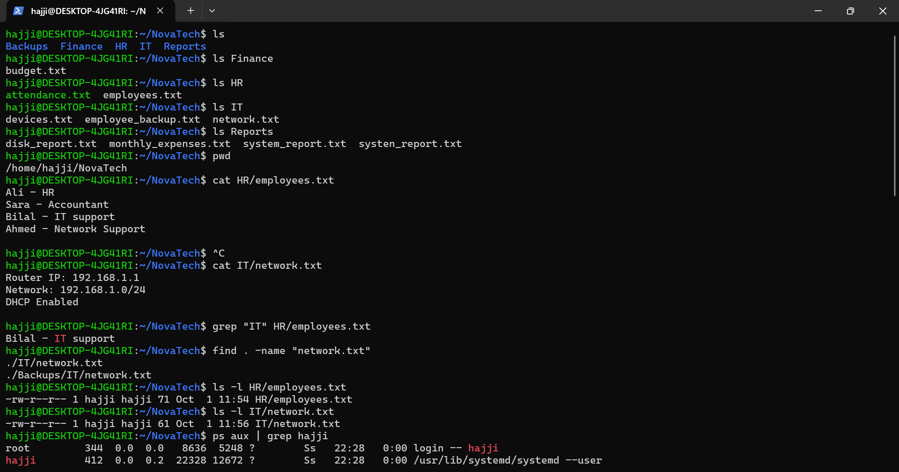
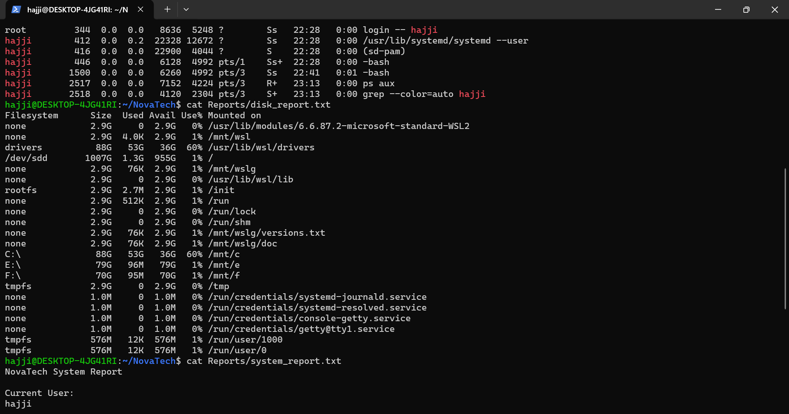

# Linux Junior IT Administrator Project

Beginner Linux administration project completed using Ubuntu on WSL.

The project simulates a small company environment called NovaTech and focuses on basic Linux system administration tasks.

## Project Tasks

- Created and organized directories and files
- Added and viewed file contents
- Copied, moved, renamed, and deleted files
- Searched text using `grep`
- Located files using `find`
- Checked and modified file permissions
- Viewed running processes
- Used pipes and output redirection
- Checked disk usage
- Created system reports
- Created backups of company files

## Commands Used

`pwd` `ls` `cd` `mkdir` `touch` `nano` `cat` `head` `tail` `less`

`cp` `mv` `rm` `grep` `find` `chmod` `whoami`

`ps` `top` `df` `du` `|` `>` `>>`

## Environment

Ubuntu running through Windows Subsystem for Linux (WSL).

## What I Learned

This project helped me practice Linux file management, navigation, permissions, process monitoring, searching, disk usage, output redirection, and backups.

I also practiced troubleshooting command errors and correcting mistakes while working in the terminal.

## Screenshots

Project structure and file management:

Disk report and system information:

System report and backup verification:

